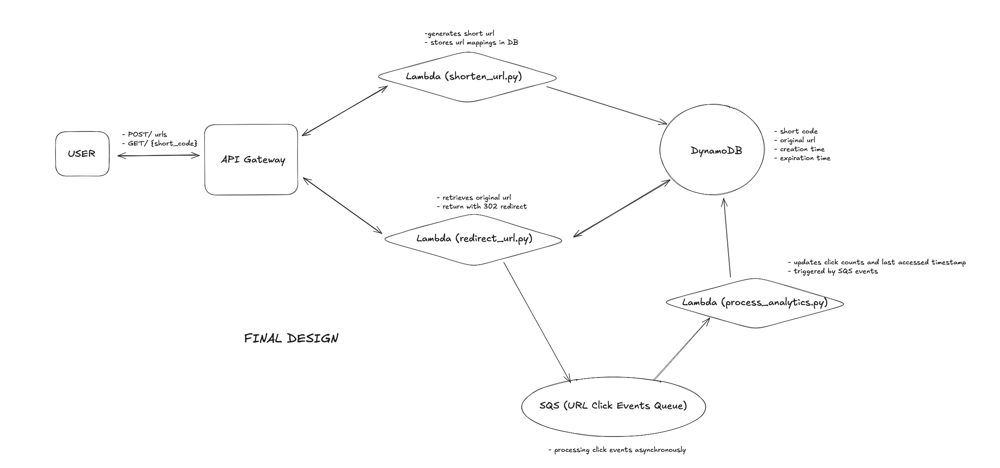
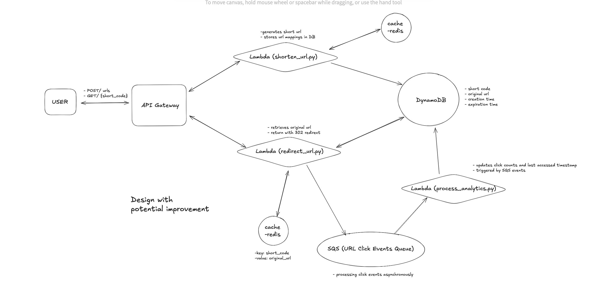

Building a serverless URL shortener application

PROBLEM STATEMENT

Build a serverless URL shortener application that creates short URLs, automatically expires them after a set duration, and tracks usage analytics using an event-driven architecture. Your solution must be implemented using Python for AWS Lambda functions and should use AWS Free Tier services. 

REQUIREMENTS

1.  REST API Endpoints :
        - POST /shorten
            ~ Accepts a JSON payload (e.g., { "url": https://example.com, "expiry_minutes": 1440 }), where the client specifies how  many minutes the URL should remain valid.
            ~ Authentication Requirement :Only authorized users can generate short URLs   
            ~ Generates a unique short identifier using your custom, authentication-based algorithm.
            ~ Stores the mapping between the short ID, the original URL, and its expiry timestamp in DynamoDB.
            ~ Returns the shortened URL (e.g., https://example.com/abc123).
        - GET /{short_id}
            ~ Retrieves the original URL from DynamoDB based on the provided short ID.
            ~ Checks the stored expiry timestamp; if the URL has expired, it returns an appropriate error (e.g., HTTP 410 Gone).
            ~ If valid, performs an HTTP redirect to the original URL.
            ~ Asynchronously triggers an event (via SQS) to log the click for analytics.
2.  Data Storage:
        - Use DynamoDB to persist URL mappings.
        - Each record must include the following attributes:
            ~ Original URL
            ~ Short code
            ~ Creation timestamp
            ~ Expiry timestamp (for auto-expiry)
        - Optionally, you may use a secondary table or an additional schema to track click analytics.
3.  Event-Driven Analytics:
        - Every time a short URL is accessed (GET endpoint), push a message to an SQS queue containing click metadata (e.g., timestamp, short ID, user-agent, IP address).
        - A separate Lambda function, triggered by SQS, should process these messages to update usage analytics (such as incrementing click counters or recording timestamps).
        - Note: Do not use DynamoDB Streams for event handling.
4.  Automatic URL Expiry:
        - Implement a mechanism that automatically marks URLs as expired based on their expiry timestamp. Checking expiry during each GET request.
        - Expired URLs should no longer redirect and must return an HTTP 410 Gone or similar error.
5.  Infrastructure as Code (IaC):
        - AWS CloudFormation to define and deploy your infrastructure.
        - Your CloudFormation template must include definitions for:
            ~ API Gateway endpoints
            ~ Lambda functions
            ~ DynamoDB tables
            ~ SQS queues and necessary IAM roles/policies
6.  Documentation and Design:
        - Provide a design document (or detailed in-code comments) that explains:
            ~ Your overall architecture (a diagram is a plus).
            ~ How the event-driven analytics with SQS is implemented.
            ~ The auto-expiry mechanism for short URLs.
            ~ Your custom, authentication-based short code generation algorithm (include a handwritten or whiteboard-style diagram ~ ~ with pseudocode or key logic, attached as a scanned image or high-quality photo).
            ~ Your error handling, testing strategy, and any trade-offs considered.

#SOLUTION WALK-THROUGH

This serverless URL Shortener application is built to create, store, and redirect short URLs. It uses AWS Lambda functions, API Gateway, DynamoDB, and SQS to ensure serverless operations and scalability. URLs automatically expire a specified duration and the analytics are tracked via an event-driven architecture.

BASIC ARCHITECTURE 

HIGH-LEVEL DESIGN & CURRENT WORKING FLOW

1. POST/shorten (Shorten URL Request): A user sends a URL to be shortened. The request contains the URL and the desired expiry time.
    - a custom short code is generated using a user-specific hash.
    - the URL mapping is stored in DynamoDB
    - a shortened URL is returned in the response.

2. GET/{short_id} (Redirect URL Request): a user accesses a shortened URL.
    - the short code is extracted from the request.
    - the original url is fetched from dynamodb
    - if the url has expired, an HTTP 410 (Gone) response is returned.
    - otherwise, the user is redirected to the original url.
    - an event containing the analytics data is pushed to SQS.

3. Analytics Processing: Every time a short URL is accessed, the data is sent to an SQS queue. A Lambda function processes the data to update the click count and timestamp in DynamoDB.

4. Auto-Expiry Mechanism: The expiry_timestamp field in DynamoDB is automatically managed using DynamoDB's Time-To-Live feature. The URL mapping is removed after the expiry timestamp is reached.

AWS Services used:
    - AWS Lambda: Serverless functions to handle URL shortening, redirection, and analytics processing.
    - Amazon API Gateway: Exposes the REST API endpoints for shortening URLs and redirecting to original URLs.
    - Amazon DynamoDB: Stores the URL mappings and click analytics.
    - Amazon SQS: Captures click events asynchronously for processing by another Lambda function.
    - IAM Roles: Used to grant the necessary permissions to Lambda functions for interacting with other AWS services.

Lambda Functions:

1. ShortenURL Function (shorten_url.py)
    - Purpose: Handles the creation of shortened URLs.
    - Process:
        ~ Extracts the original URL and expiry time from the request body.
        ~ Uses a custom algorithm to generate a short code based on the user ID and original URL.
        ~ Stores the mapping (short code, original URL, expiry timestamp) in DynamoDB.
        ~ Returns the shortened URL in the response.
    - Authentication: Extracts user ID from the request context to create a unique short code for each user.
    - Expiry Handling: The expiry timestamp is calculated based on the input and stored in DynamoDB.

2. RedirectURL Function (redirect_url.py)
    - Purpose: Handles URL redirection when a user accesses a shortened URL.
    - Process:
        ~ Retrieves the original URL from DynamoDB using the short ID from the path.
        ~ Checks if the URL has expired (based on the expiry timestamp).
        ~ If expired, returns HTTP 410 (Gone). Otherwise, redirects the user to the original URL.
        ~ Logs the click event in an SQS queue for analytics.
    - Analytics Logging: Sends a message to the SQS queue containing click metadata.

3. ProcessAnalytics Function (process_analytics.py)
    - Purpose: Processes analytics events from the SQS queue.
    - Process:
        ~ For each record in the SQS message, it updates the click_count and last_accessed timestamp in DynamoDB.
    - Event-Driven: This function is triggered by SQS events, ensuring that analytics are processed asynchronously.

CUSTOM SHORT CODE GENERATION ALGORITHM

The application has a custom short code generation algorithm that is required to address issues of uniqueness, user-specific codes, security, flexibility, and scalability, while also ensuring the system performs efficiently as the number of generated short URLs grows. It allows for precise control over the entire URL shortening process, ensuring it meets the specific needs of the solution.
The short code is generated based on the following approach:

- Hashing: A SHA-256 hash is generated from the concatenation of the user ID and the original URL.
- Base64 Encoding: The resulting hash is base64 encoded to create a URL-safe string.
- Shortened Output: The first 8 characters of the base64 string are used as the short code.

AUTO-EXPIRY MECHANISM

DynamoDB's Time-to-Live (TTL) feature is used to automatically delete expired URL mappings. The expiry timestamp is stored in DynamoDB and is used to determine when the record should be deleted.

    - When the URL expires (based on expiry_timestamp), DynamoDB will automatically remove the record from the table.
    - This is managed by setting the expiry_timestamp field as the TTL attribute in the DynamoDB table.

ERROR HANDLING

1. Shorten URL (POST /shorten):
    - If the URL is missing from the request body, the response is a 400 Bad Request error.
    - If there are any other exceptions during the processing, a 500 Internal Server Error is returned.
2. Redirect URL (GET /{short_id}):
    - If the short ID is not found in DynamoDB, the response is a 404 Not Found error.
    - If the URL has expired, the response is a 410 Gone error.
    - Any other exceptions result in a 500 Internal Server Error.

CloudFormation Template (serverless-url-shortener.yml)

The CloudFormation template defines the infrastructure for the serverless URL shortener:

1. DynamoDB Tables:
     Stores URL mappings and tracks the click count and timestamp for each short URL.
2. API Gateway:
     Exposes two endpoints: POST /shorten GET /{short_id}.
3. Lambda Functions:
     ShortenURLFunction: Handles URL shortening.
     RedirectURLFunction: Handles URL redirection and logging analytics.
     ProcessAnalyticsFunction: Processes analytics events from SQS.
4. IAM Roles:
     Lambda functions are granted the necessary permissions to interact with DynamoDB, SQS, and API Gateway.
5. SQS Queue:
     Captures click events for analytics processing.

Potential Deep Dives

1. How can we ensure short urls are unique?

Unique Counter with Base62 Encoding:
    Using an incrementing counter and Base62 encoding ensures unique and collision-free short URLs. Redis is ideal for managing this counter due to its atomic INCR operation, which guarantees uniqueness without race conditions. This approach is highly efficient, scalable, and allows easy decoding for database lookups.

2. How can we ensure that redirects are fast?

Leveraging Content Delivery Networks (CDNs) and edge computing:
    Using CDNs and edge computing reduces latency by caching short URL mappings at geographically distributed nodes. Platforms like Cloudflare Workers or AWS Lambda@Edge enable redirections directly at the CDN level, avoiding the need to reach the origin server. This speeds up responses, especially for popular short URLs.

DESIGN WITH POTENTIAL IMPROVEMENT

